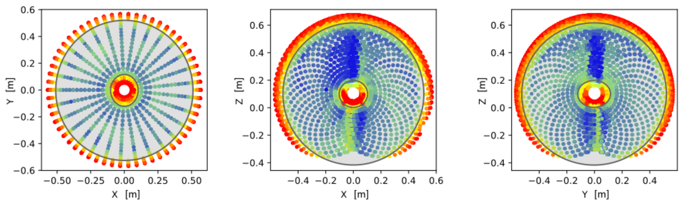
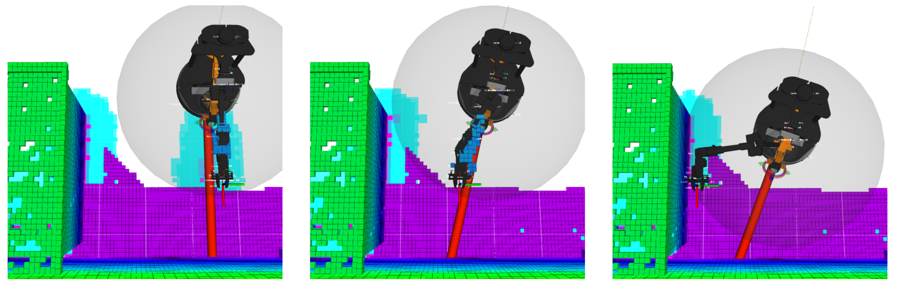
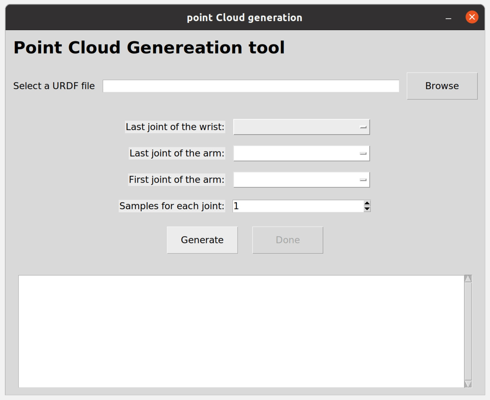

# Mobile manipulator base placement optimization using an ellipsoidal reachability model

## Table of contents
+ [Introduction](#introduction)
+ [Installation](#installation)
    + [Disclaimer](#disclaimer)
    + [Prerequisites](#prerequisites)
    + [Install the code in this repository](#install-the-code-in-this-repository)
    + [Install pymoo](#install-pymoo)
+ [Documentation](#documentation)
    + [reach_space_modeling module](#reach_space_modeling-module)
    + [base_optimization](#base_optimization-module)
    + [Code Adaptation](#code-adaptation)
+ [Simulation tutorial](#simulation-tutorial)
+ [Possible errors](#possible-errors)
    + [Errors while parsing the URDF file](#errors-while-parsing-the-urdf-file)
+ [Cite us](#cite_us)

## Introduction
This repository provides tools and resources for **optimal base placement of mobile manipulators** using a compact **ellipsoidal model of their reachability space**. 

A first tool allows to **compute the reachability map of a manipulator** starting from its kinematic model. Actually, this first tool is an extension of the one available at https://github.com/Saro0800/Robotic-manipulators-reachability-space-modeling. \
For each reachable point, a **reachability measure** is assigned by evaluating multiple end-effector orientations through inverse kinematics and collision checking. This process yields a dense representation of the robot’s dexterity across its workspace.

Starting from this reachability distribution, **a mathematical model based on two concentric ellipsoids is obtained**. These ellipsoid equations describe the region of the workspace where the manipulator exhibits the **highest level of dexterity**, and their parameters are identified through a dedicated **optimization problem**. The reachaiblity distribution and the corresponding ellipsoids are visualized below.

<div align="center">
    
</div>

This ellipsoidal model is then exploited in a **second optimization problem**, designed to autonomously determine an optimal **mobile base pose** to reach a target end-effector position. The approach simultaneously ensures:
* high manipulability of the end-effector,
* correct orientation of the robot toward the target,
* and **reduced collision risk** with the surrounding environment.

<div align="center">
    
</div>


Different optimization algorithms can be used to solve the optimization problems, allowing users to balance convergence time and optimality depending on application requirements.

The code contained in this repository has been used for the experimental evaluation in the paper [**“Mobile Manipulator Base Placement Optimization Using an Ellipsoidal Reachability Model”**](https://ieeexplore.ieee.org/document/11205534).

**Keywords**: Mobile Manipulators, Base Placement Optimization, Reachability Space, Ellipsoid Modeling, Optimization.

## Installation
### Disclaimer
Due to robot-related constraints, the code in this repository has been developed and tested using **Python 3.8.10** on **Ubuntu 20.04 LTS**, that is the latest version supporting **ROS 1 Noetic**.

In any case, the provided code should work for newer versions of Python too, and could be easily adapted for ROS 2 as well. However, it has not been tested for such configurations. For more recent versions of Python and ROS, the used libraries may have received major updates and some errors may arise.

### Prerequisites
Before installing and using this repo, please be sure to meet the following prerequisites:
1. **Python version**: The code proposed here has been developed and tested using Python 3.8.10. You can download it from [here](https://www.python.org/downloads/).
2. **ROS**: You need to have **ROS Noetic** installed. For the installation, please check the [official website](https://wiki.ros.org/noetic/Installation/Ubuntu). **Note**: installing "ros-noetic-desktop-full" is recommended.
3. **git**: install git
    ```
    sudo apt-get install git
    ```
4. **pip**: install pip to retrieve common libraries:
    ```
    sudo apt-get install python3-pip
    ```
5. **Cython**: install Cython languange to build C extentions from Python code:
    ```
    pip install Cython==0.29.34 
    ```
6. **Octomap**: install the Octomap plugin for ROS:
   ```
   sudo apt-get install ros-noetic-octomap*
   ```  
7. *[Optional]* **MoveIt**: install MoveIt:
    ```
    sudo apt-get install ros-noetic-moveit*
    ```
8. *[Optional][Needed to run the provided simulaiton]*: **interbotix_xs_sdk**\
   Follow the **Remote installation** tutorial provided by Trossen Robitcs [here](https://docs.trossenrobotics.com/interbotix_xslocobots_docs/ros_interface/ros1/software_setup.html#software-installation).\
   If you don't need/want to run the simulation, please remove the ```interbotix_ros_xslocobot``` folder from ```src``` before running ```catkin_make```.

### Install the code in this repository
To use the code provided in this repository, please follow these steps:
1. Clone the repository inside your workspace:
    ```
    git clone https://github.com/Saro0800/base_pose_opt_ws.git
    ```
2. Install the needed libraries:
    ```
    pip install -r requirements.txt
    ```


### Install pymoo
Classes and methods from the pymoo library have been extensively used in the provided implementation. As stated in the [installation guide](https://pymoo.org/installation.html), there are different ways to install and use the pymoo library. Among the others, installing and using pymoo with compiled modules can significantly speed up some operations.

The results presented and discussed in the paper associated with this repository have been obtained using **pymoo 0.6.0.1** with **compiled modules**.

To install it, follow these steps:
1. Go to the "releases" section of the pymoo github repository: https://github.com/anyoptimization/pymoo/releases ;
2. Download the source code of **Version 0.6.0.1** (the .zip or .tar.gz archive under the *Assets* submenu);
3. Extract the archive;
4. Go to the extracted folder
    ```
    cd path/to/pymoo-0.6.0.1
    ```
5. Compile the submodules:
    ```
    make compile
    ```
6. Install pymoo with compiled modules in your environment:
    ```
    pip install .
    ```
## Documentation
The code provided to compute the optimal base pose of a mobile manipulator can be divided in 3 main modules, that are contained inside the "src" folder. The modules are named **`base_optimization`**, **`interbotix_ros_xslocobot`** and **`reach_space_modeling`**.

### reach_space_modeling module
It is the extension of the code contained in [this repository](https://github.com/Saro0800/Robotic-manipulators-reachability-space-modeling), where the reachable space of a manipulator has been modeled using a single ellipsoid equations. Differently, in this paper the optimal reachable space has been modeled using two concentric ellipsoids.

The `reach_space_modeling` module is divided into two sub-modules: **`generate_pointcloud`** and **`opt_problem`**.

#### generate_pointcloud
The aim of this submodule is to generate a pointcloud representing the set of points reachable by the manipulator. For covenience, the `genereate_pointcloud` folder contains a subfolders named `model`, that contains some example URDF files. You can place the URDF file of your robot inside this folder to easily find it using the *Point Cloud Generation tool*.

By executing `gen_cloud_reach_metric.py`, a practical GUI to generate the point cloud shows up (whose elements and methods are defined in gen_cloud_GUI.py), as illustrated in the figure below. [Here](https://github.com/Saro0800/Robotic-manipulators-reachability-space-modeling/tree/main/generate_pointcloud) you can find a detailed documentation on how to use the GUI, while , for the details on how the point cloud is computed, please refere to Section 4.1 of [this paper](https://link.springer.com/article/10.1007/s10846-025-02294-5).

By pressing the button "Generate", a set of points is generated. The coordinates of such points are defined with respect to the reference frame attached to the *parent link* (using the URDF notation) of the joint selected as *first joint of the arm* in the GUI.

<div align="center">
    
</div>

After the user finishes selecting parameters in the GUI by pressing the button "Done" (or by closing the windows), the script executes the following main steps to compute and visualize the reachability metric:
+ `generate_reachability_index()`: Generates a reachability score for every point in the cloud. This includes:
    + Sampling orientations around each point.
    + Initializing the KDL model and IK solvers.
    + Loading the robot in PyBullet for self-collision checks.
    + Running IK for every pose at every point and incrementing the point’s score whenever a valid, + collision-free configuration exists.

+ `vis_cloud_with_measure()`: Displays the computed reachability cloud using a 3D scatter plot. Points are colored according to their reachability index, providing a visual metric of how easily the robot can reach each region of space.

+ `publish_pointcloud_msg(colors)`: Creates and publishes a ROS MarkerArray message containing the colored reachability cloud. Each point is published as a small colored marker for visualization in RViz.

#### opt_problem
The objective of this submodule is to compute the equations of the concentric ellipsoids.

By running `find_ellips_eq_reach_opt.py`, first the point cloud generation and reachability distribution computation process illustrated above is executed, then the `solve_eqn_prob` function is called. This function create an instance of the optimization problem formulated to obtain the ellipsoid equations, and then solve it using the desired optimization algorithm. The optimization problem, whose mathematical definition is contained in Section 3 of [the related paper](https://ieeexplore.ieee.org/document/11205534), is defined inside the `problem_formulation_reach_opt.py` file.

At the end of the optimization process, the 9 parameters characterizing the equations of the concentric ellipsoids are computed, and the ellipsoids along with their center are visualized in Rviz as ROS Markers. Again, the coordinates of the center are defined with respect to the reference frame attached to the *parent link* of the joint selected as *first joint of the arm* in the GUI.

### base_optimization Module

The `base_optimization` folder provides the full pipeline for computing the optimal mobile base pose that enables the robot to reach a desired end-effector pose while minimizing alignment error and avoiding obstacles.  
It includes both the optimization problem formulation and the execution node that performs data acquisition, optimization, and robot control.

---

#### find_opt_pose.py

This script computes and executes the optimal base pose once a desired end-effector pose is provided.

**Main Workflow**
1. **Retrieve Ellipsoid Parameters**  
   The node calls `/get_ellipsoid_params` to load the ellipsoid center, inner/outer axes, and reference frame.  
   These parameters are transformed into both the map frame and the mobile base frame.

2. **Wait for Desired End-Effector Pose**  
   The node listens to `/des_EE_pose`.  
   When a pose is received, it parses the target position/orientation and publishes it for visualization.

3. **Convert Octomap to Point Cloud**  
   The occupancy grid from Octomap is converted to a point cloud.  
   The resulting `PointCloud2` is converted to a NumPy array.

4. **`find_opt_base_pose(...)`**  
   Constructs a `BasePoseOptProblem` instance and solves it using the desired optimizer.  
   The solution (x, y, θ) minimizes misalignment and collision risk.  
   The predicted optimal base pose is published for visualization.

5. **Transform Solution Into Base Target**  
   The optimal pose is transformed using the relative ellipsoid–base reference frame to ensure the ellipsoid center reaches its intended location.

6. **`send_opt_base_pose(...)`**  
   Sends the optimal base pose to the `move_base` action server and waits until the goal is reached.

7. *(Optional)* **`move_arm()`**  
   If enabled, MoveIt executes the arm motion to the desired end-effector pose after the base is positioned.

---

#### problem_formulation_align_collision.py

This file defines the optimization problem used during base pose computation.

**`BasePoseOptProblem` Class**
Defines a constrained, single-objective optimization problem that evaluates how suitable a candidate base pose is based on:

- Alignment between the ellipsoid reference frame and the desired end-effector pose  
- Satisfaction of inner and outer ellipsoid constraints  
- Collision avoidance based on the occupancy point cloud  

**Main Components**
1. **Initialization**  
   Receives:
   - Ellipsoid center  
   - Outer and inner axes  
   - Desired end-effector pose  
   - Occupancy point cloud  
   
   It builds required transformation matrices, extracts cloud coordinates, and defines bounds for (x, y, θ).

2. **`_evaluate(x, out, ...)`**  
   For a candidate base pose:  
   - Computes transformations to the ellipsoid frame  
   - Projects desired pose and orientation into that frame  
   - Computes angular alignment terms  
   - Counts points inside both ellipsoids  
   - Defines three inequality constraints  
   - Computes the objective function combining alignment error and collision count  

The optimizer minimizes this objective to determine the best base placement.

---

### Code adaptation
Inside the code of the `base_optimization` module, the name of some topics, services and reference frames have been hard coded for simplicity. Here it follows a detailed list of changes to be done in order to use this code on other robots.

*Note*: is the namespace of our robot, so you should change it with yours.

1. **`find_opt_pose.py`**
    + **/locobot/octomap2cloud_converter_srv** is the name of the service used to request the conversion of the occupancy grid into a point cloud &rarr just change the namespace "locobot" with yours
    + **/locobot/base_footprint** &rarr change it with the name of the reference frame attached to the base of your mobile robot
    + **/locobot/move_base** is the name of the action client of the *move_base* package &rarr change it with the action client you are using to move the mobile base
    + **/locobot/joint_states** is the name of the topic publishing the state of the joints (used by MoveIt) &rarr change it accordingly
    + **/locobot/robot_description** &rarr change it with the name on the parameter server containing the description of your robot
2. **`octo2cloud_converter.cpp`** (you need to recompile everything with `catkin_make`)
    + **/locobot/octomap_server/octomap_binary** &rarr change it with the name of the topic where Octomap publish the binary map of your environment
3. **``**


## Simulation tutorial
To test the code, we provide a simulation environment. It makes use of the code contained in [this repository](https://github.com/Interbotix/interbotix_ros_rovers/tree/main) from Trossen Robtics. The simulation uses the LoCoBot mobile manipulator, a 6 DOF manipulator with parallel fingers mounted on top of a mobile base with differential wheels.

To run the simulation, please follow these steps:
1. Create your ROS workspace and copy all the folders in the src folder of this repo inside the src folder of your workspace.
2. Build your workspace
    ```
    catkin_make
    ```
3. Source your newly created workspace:
    ```
    source devel/setup.bash
    ```
4. Start the main components:
    ```
    roslaunch interbotix_xslocobot_nav xslocobot_nav_sim.launch
    ```
    This will start the simulaiton on Gazebo, Rviz for visualization, and the procedure to obtain the mathematical model of the reachable space of the used robot.
5. In a new terminal, activate the simulation:
    ```
    rosservice call /gazebo/unpause_physics
    ```
6. In a new terminal, source your ROS workspace and start the node to find optimal base placement:
    ```
    cd /path/to/your_ros_ws
    source devel/setup.bash
    rosrun base_optimization find_opt_pose.py __ns:=locobot
    ```
7. In a new terminal, source your ROS workspace and start the node to publish the desired end-effector pose:
    ```
    cd /path/to/your_ros_ws
    source devel/setup.bash
    rosrun base_optimization des_EE_pose_publisher.py __ns:=locobot
    ```

## Possible errors
### Errors while compiling the pymoo modules
When running ```make compile``` inside the ```pymo-0.6.0.6``` folder, you may encounter the following error:
```
python setup.py build_ext --inplace
make: python: Command not found
make: *** [Makefile:11: compile] Error 127
```

This simply means that the command ```python```, that is an alias for ```python3``` used to run python scripts, has not been defined. This can be simply solved by running:
```
sudo ln -s /usr/bin/python3 /usr/bin/python
```

### Errors while parsing the URDF file
The python module used to parse the URDF file is `urdfpy`. This module needs relative/absolute paths to be used for the mesh files. For this reason, when you copy the URDF of your robot inside the "model" folder of the "generate_pointcloud" modules, please be sure to specify relative/absolute paths for the meshes, otherwise `urdfpy` will fail to parse your URDF file.

## Cite us
If you use the code in this repository in your research, please cite the following paper:
```
@INPROCEEDINGS{11205534,
  author={Cavelli, Rosario Francesco and David Cen Cheng, Pangcheng and Indri, Marina},
  booktitle={2025 IEEE 30th International Conference on Emerging Technologies and Factory Automation (ETFA)}, 
  title={Mobile manipulator base placement optimization using an ellipsoidal reachability model}, 
  year={2025},
  pages={1-8},
  keywords={Adaptation models;Mathematical models;End effectors;Optimization;Manufacturing automation;Ellipsoids;Mobile manipulators;Robot base placement optimization;Reachability space},
  doi={10.1109/ETFA65518.2025.11205534}}
```
